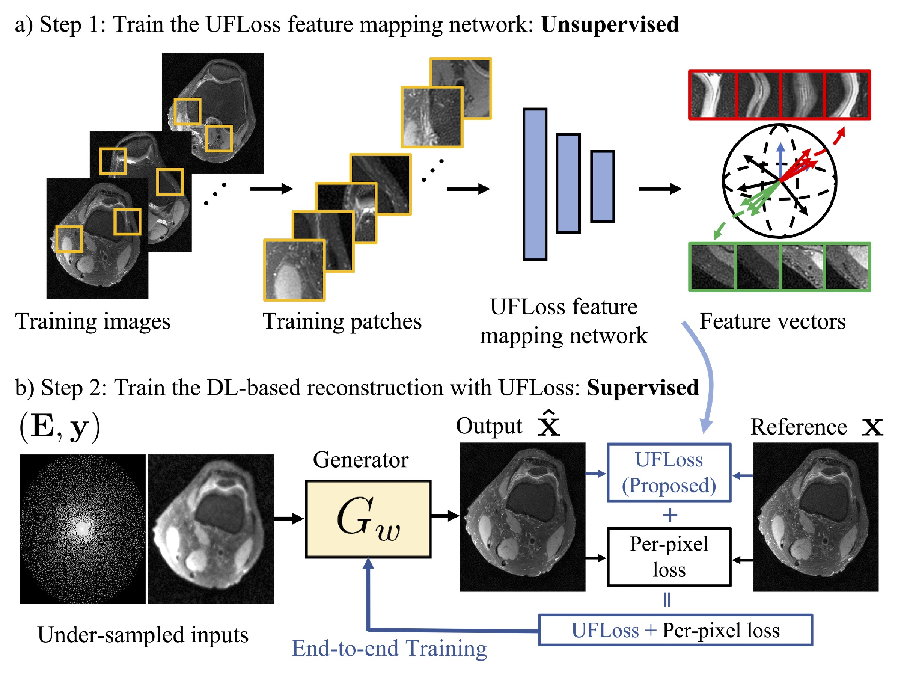

# Unsupervised Feature Loss (UFLoss) for High Fidelity Deep learning (DL)-based reconstruction

Official github repository for the paper "High Fidelity Deep Learning-based MRI Reconstruction with Instance-wise Discriminative Feature Matching Loss". In this work, a novel patch-based Unsupervised Feature loss (UFLoss) is proposed and incorporated into the training of DL-based reconstruction frameworks in order to preserve perceptual similarity and high-order statistics. In-vivo experiments indicate that adding the UFLoss encourages sharper edges with higher overall image quality under DL-based reconstruction framework.