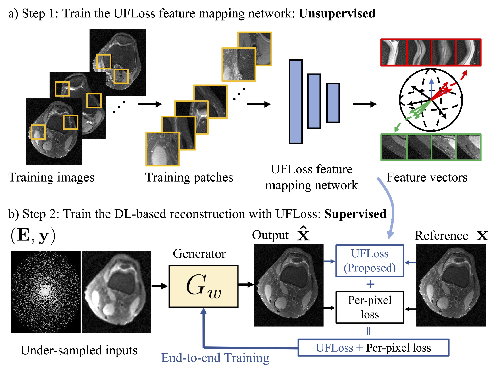

# Unsupervised Feature Loss (UFLoss) for High Fidelity Deep learning (DL)-based reconstruction


Official github repository for the paper "High Fidelity Deep Learning-based MRI Reconstruction with Instance-wise Discriminative Feature Matching Loss". In this work, a novel patch-based Unsupervised Feature loss (UFLoss) is proposed and incorporated into the training of DL-based reconstruction frameworks in order to preserve perceptual similarity and high-order statistics. In-vivo experiments indicate that adding the UFLoss encourages sharper edges with higher overall image quality under DL-based reconstruction framework. Our implementations are in [PyTorch](https://pytorch.org/)


## Installation
To use this package, install the required python packages (tested with python 3.8 on Ubuntu 20.04 LTS):
```bash
pip install -r requirements.txt
```

## Dataset

We used a subset of [FastMRI](https://fastmri.org/) knee dataset for the training and evaluation. We used E-SPIRiT to pre-compute sensitivity maps using [BART](https://mrirecon.github.io/bart/). Post-processed data (including Sens Maps, Coil combined images) can be requested by emailing the [author]<kewang@berkeley.edu>.