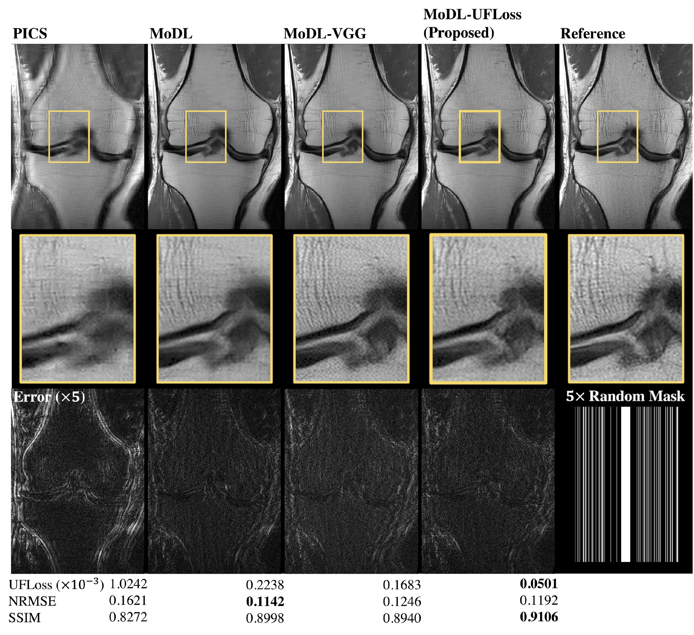

# Unsupervised Feature Loss (UFLoss) for High Fidelity Deep learning (DL)-based reconstruction


Official github repository for the paper [High Fidelity Deep Learning-based MRI Reconstruction with Instance-wise Discriminative Feature Matching Loss](https://arxiv.org/abs/2108.12460). In this work, a novel patch-based Unsupervised Feature loss (UFLoss) is proposed and incorporated into the training of DL-based reconstruction frameworks in order to preserve perceptual similarity and high-order statistics. In-vivo experiments indicate that adding the UFLoss encourages sharper edges with higher overall image quality under DL-based reconstruction framework. Our implementations are in [PyTorch](https://pytorch.org/)


## Installation
To use this package, install the required python packages (tested with python 3.8 on Ubuntu 20.04 LTS):
```bash
pip install -r requirements.txt
```

## Dataset

We used a subset of [FastMRI](https://fastmri.org/) knee dataset for the training and evaluation. We used E-SPIRiT to pre-compute sensitivity maps using [BART](https://mrirecon.github.io/bart/). Post-processed data (including Sens Maps, Coil combined images) and pre-trained model can be requested by emailing <kewang@berkeley.edu>.


## Step 0: Patch Extraction
To extract patches from the fully-smapled training data, go to the `UFloss_training/` folder and run `patch_extraction.py` to extract patches. Please specify the directories of the training dataset and the target folder.
Instructions are avaible by runing:

```bash
python patch_extraction.py -h
```

## Step 1: Train the UFLoss feature mapping network

To train the UFLoss feature mapping network, go to the `UFloss_training/` folder and run `patch_learning.py`. We provide a demo training script to perform the training on fully-sampled patches:

```bash
bash launch_training_patch_learning.sh
```

Visualiztion (Patch retrival results, shown below) script will be available soon.


## Step 2: Train the DL-based reconstruction with UFLoss

To train the DL-based reconstruction with UFLoss, we provide our source code here at `DL_Recon_UFLoss/`. We adoped [MoDL](https://arxiv.org/abs/1712.02862) as our DL-based reconstruction network. We provide training scripts for MoDL with and without UFLoss at `DL_Recon_UFLoss/models/unrolled2D/scripts`:
```bash
bash launch_training_MoDL_traditional_UFLoss_256_demo.sh
```
You can easily paly around with the parameters by editing the training script. One representative reconstruction results is shown as below.



## Perform inference with the trained model
To perform the inference reconstruction on the testing set, we provide an inference script at `DL_Recon_UFLoss/models/unrolled2D/inference_ufloss.py`.
run the following command for inference:
```bash
python inference_ufloss.py --data-path <Path to the dataset> 
                        --device-num <Which device to train on>
                        --exp-dir <Path where the results should be saved>
                        --checkpoint <Path to an existing checkpoint>
```
## Acknoledgements
Code borrows heavily from [fastMRI](https://github.com/facebookresearch/fastMRI) Github repo. This work is a colaboration between UC Berkeley and GE Healthcare. Please contact <kewang@berkeley.edu> if you have any questions.GI